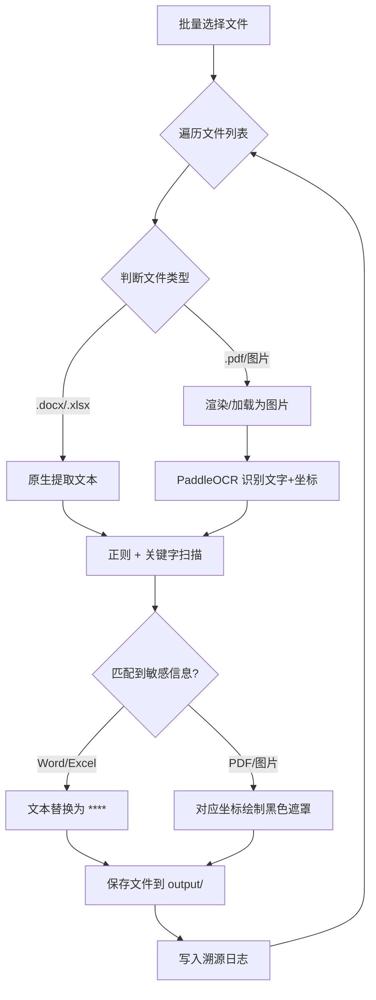

# 银行水单敏感信息脱敏工具 (Sensitive Redaction Tool)

本工具是一款专为处理银行水单（PDF/图片/Word/Excel）而设计的**完全离线**敏感信息脱敏软件。它结合了高精度 OCR 识别与多层智能匹配策略，帮助用户快速、准确地遮盖账号、金额、姓名等高度敏感信息，有效预防数据合规风险。

---

## 🌟 核心特性

1.  **完全离线处理**：所有 OCR 识别与逻辑匹配均在本地完成，无需连接互联网，确保数据 100% 留存在本地环境。
2.  **银行维度管理**：支持针对不同银行（Bank）独立配置脱敏规则。您可以为不同银行设置专有的关键字列表，适应其独特的表单版式。
3.  **多层匹配引擎**：
    *   **精准名单/正则模式**：直接命中预设的特定账号或符合特定模式（如 IBAN、身份证）的字符串。
    *   **关键字触发模式**：识别如 `Account Number`、`Beneficiary` 等标签，并智能判断其相邻的“数值框”进行打码。
4.  **智能防误伤机制**：
    *   **语义边界保护**：自动识别全英文词汇边界，防止规则 `Account` 错误匹配到 `Bank Account Name`。
    *   **智能特征评分**：自动过滤低置信度的文本块（如金额、参考号中的普通字母），防止非敏感信息被牵连。
5.  **透明化溯源日志**：每一处打码都有理有据。通过日志系统可以清晰查看触发原因（如：由关键词「Account」触发）。

---

## 🛠️ 技术栈与选型

基于性能与离线分发的考量，我们选择了以下技术栈：

| 层面 | 技术 | 理由 |
|------|------|------|
| **语言** | Python 3.10 | 生态丰富，OCR 与文档处理能力强 |
| **GUI** | ttkbootstrap | 基于 tkinter 的现代化主题，适合打包独立桌面应用 |
| **OCR** | PaddleOCR (CPU) | 中文识别准确率领先，适配各种银行水单场景 |
| **PDF 处理** | PyMuPDF (fitz) | 采用“渲染为图片+叠加遮罩”方案，确保打码不可被逆向清除 |
| **文档处理** | python-docx / openpyxl | 分别支持 Word 和 Excel 的原生内容脱敏 |
| **打包** | PyInstaller | 生成单个免安装 exe，内置所有依赖环境 |

---

## 📐 核心处理流程

工具采用“非破坏性”与“遮罩”双重策略，具体逻辑如下：



---

## 📂 项目结构概览

```text
├── main.py                   # 入口（启动 GUI）
├── rules.json                # 脱敏规则持久化文件
├── core/
│   ├── scanner.py            # 扫描引擎（正则 + 词边界匹配）
│   ├── redactor.py           # 脱敏任务调度器
│   └── ocr_engine.py         # PaddleOCR 离线提取封装
├── processors/
│   ├── pdf_processor.py      # PDF 渲染与遮罩重组逻辑
│   └── image_processor.py    # 基于坐标的图片打码逻辑
├── gui/
│   ├── app.py                # 主界面容器
│   └── rules_tab.py          # 规则管理与测试界面
└── output/                   # 脱敏后的文件存放地
```

---

## 🚀 快速上手

### 1. 配置规则
- **银行配置**：为不同银行创建模板，系统会自动注入 `IBAN`、`A/C Number` 等默认模板。
- **精准名单**：在「规则配置」中录入需打码的账号，或由系统提供的内置正则（默认关闭，可根据需求开启）。

### 2. 执行脱敏
- 在「文件处理」页拖入 PDF/图片/Word/Excel 文件。
- 选择对应的银行模板和语言（中/英）。
- 点击“开始脱敏”。

### 3. 查看日志
- 处理完成后，在「脱敏日志」查看明细。
- **溯源说明**：点击详情可看到类似于 `· [账号(模板)] "XXX" <= (命中关键字: A/C Number)` 的记录。

---

## 📦 打包与分发
本项目可通过 PyInstaller 打包为单个可执行文件（exe）：
*   **打包体积**：由于内置了 PaddleOCR 模型和 PaddlePaddle CPU 运行环境，exe 体积约为 **300-500MB**。
*   **兼容性**：无需在目标机器安装 Python 环境，支持 Windows 10/11。

---
*Inspired by: Microsoft Presidio, pdf-redactor, and logic designed for complex bank statements.*
