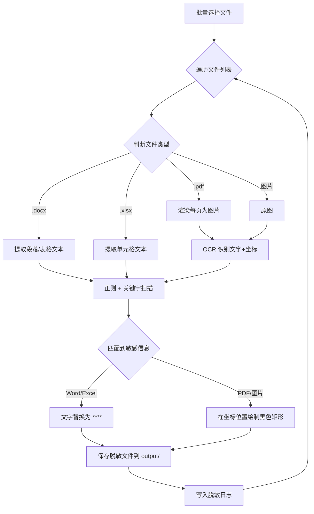

# 银行水单敏感信息脱敏工具

## 背景

银行水单中包含账户号码、户名、交易金额等敏感信息。需构建一个**完全本地化、可独立运行**的脱敏工具，打包为 exe 分发给无 Python 环境的业务同事。

---

## 技术选型

| 层面 | 技术 | 理由 |
|------|------|------|
| 语言 | Python 3.10 | 生态丰富，OCR/文档处理库成熟 |
| GUI | tkinter (ttkbootstrap) | Python 内置，打包简单，独立桌面应用 |
| OCR | PaddleOCR (CPU) | 中文识别准确率最高，银行水单场景必需 |
| Word | python-docx | 读写 .docx |
| Excel | openpyxl | 读写 .xlsx |
| PDF | PyMuPDF (fitz) | 渲染页面为图片 + 叠加遮罩 |
| 图片 | Pillow | 绘制黑色遮罩 |
| 打包 | PyInstaller | 打包为单个 exe，含所有依赖 |

> [!NOTE]
> **GUI 改用 tkinter 而非 Flask**：用户要求打包为独立 exe，桌面 GUI 更合适。`ttkbootstrap` 提供现代化主题，无需浏览器。

> [!IMPORTANT]
> **关于 PaddleOCR 打包**：PaddleOCR + PaddlePaddle CPU 版打包后 exe 约 300-500MB。这是纯 CPU OCR 方案的正常体积。备选方案 EasyOCR 依赖 PyTorch，体积同样较大。

---

## 开源项目参考

| 项目 | 借鉴点 |
|------|--------|
| [microsoft/presidio](https://github.com/microsoft/presidio) | PII 检测框架的模式匹配 + 实体识别架构 |
| [ltillmann/pdf-redactor](https://github.com/ltillmann/pdf-redactor) | PDF 遮罩脱敏的实现方式（IBAN/BIC 检测） |
| [DataFog](https://github.com/DataFog/datafog-python) | 图片 PII 检测 + OCR 集成模式 |
| [brootware/PyRedactKit](https://github.com/brootware/PyRedactKit) | 正则规则引擎 + CLI 批量处理 |

---

## 架构设计

```
d:\AI\project\sensitive\
├── main.py                   # 入口（启动 GUI）
├── config.py                 # 应用配置常量
├── requirements.txt          # 依赖清单
├── build.spec                # PyInstaller 打包配置
├── rules.json                # 脱敏规则（持久化）
│
├── core/
│   ├── __init__.py
│   ├── scanner.py            # 敏感信息扫描引擎（正则 + 关键字标签）
│   ├── redactor.py           # 脱敏调度器
│   ├── ocr_engine.py         # PaddleOCR 封装
│   ├── patterns.py           # 内置正则模式库
│   └── logger.py             # 脱敏日志记录
│
├── processors/
│   ├── __init__.py
│   ├── base.py               # 处理器基类
│   ├── word_processor.py     # Word 脱敏（文字替换）
│   ├── excel_processor.py    # Excel 脱敏（单元格替换）
│   ├── pdf_processor.py      # PDF 脱敏（渲染为图片 → 遮罩）
│   └── image_processor.py    # 图片脱敏（黑色遮罩）
│
├── gui/
│   ├── __init__.py
│   ├── app.py                # 主窗口
│   ├── file_tab.py           # 文件处理标签页
│   ├── rules_tab.py          # 规则配置标签页
│   └── log_tab.py            # 脱敏日志标签页
│
├── tests/
│   ├── test_scanner.py       # 扫描引擎测试
│   ├── test_processors.py    # 处理器测试
│   └── samples/              # 模拟测试样本
│
└── output/                   # 脱敏文件输出目录
```

---

## 核心流程



---

## 脱敏规则设计

`rules.json` 结构，通过 GUI 规则配置页管理：

```json
{
  "patterns": [
    {"id": "bank_account", "name": "银行账号", "regex": "\\b\\d{16,19}\\b", "enabled": true},
    {"id": "phone", "name": "手机号码", "regex": "1[3-9]\\d{9}", "enabled": true},
    {"id": "id_card", "name": "身份证号", "regex": "\\d{17}[\\dXx]", "enabled": true}
  ],
  "keywords": [
    {"id": "payer_name", "name": "付款方户名", "labels": ["付款人","付款方","汇款人","付款户名"], "action": "redact_value", "enabled": true},
    {"id": "payer_account", "name": "付款方账号", "labels": ["付款账号","付款方账号","汇款账号"], "action": "redact_value", "enabled": true}
  ],
  "replacement": "****"
}
```

**关键字标签脱敏逻辑**：扫描到"付款人"等标签时，将其后方紧邻的值（同行文本或下一个单元格）识别为敏感信息并脱敏。

---

## GUI 设计

三个标签页的桌面应用（ttkbootstrap 现代主题）：

### 标签页1：文件处理
- **批量文件选择**（支持拖拽或文件对话框）
- 文件列表展示（文件名、类型、状态）
- "开始脱敏"按钮 + 进度条
- 处理完成后一键打开输出目录

### 标签页2：规则配置
- 正则模式列表（增删改 + 启用/禁用开关）
- 关键字标签列表（增删改 + 启用/禁用开关）
- 替换字符设置
- 规则测试区（输入文本 → 查看匹配结果）

### 标签页3：脱敏日志
- 历史脱敏记录列表
- 每条记录：时间、文件名、脱敏项数量、详细信息
- 日志导出功能

---

## PDF 处理策略

> [!NOTE]
> 按用户要求，PDF 统一采用**遮罩方案**：
> 1. 用 PyMuPDF 将每页渲染为高分辨率图片
> 2. 用 PaddleOCR 识别文字及其坐标
> 3. 扫描敏感信息，在匹配位置绘制黑色矩形
> 4. 将处理后的图片重新合成为 PDF
>
> 优点：简单可靠，无字体嵌入问题。缺点：输出 PDF 为纯图片，文件体积增大，不可搜索。

---

## 打包方案

```bash
# PyInstaller 打包命令
pyinstaller --onefile --windowed --name "银行水单脱敏工具" \
  --add-data "rules.json;." \
  --hidden-import paddleocr \
  --hidden-import paddle \
  --collect-all paddleocr \
  --collect-all paddle \
  main.py
```

关键注意事项：
- 使用 `--onefile --windowed` 生成单个无控制台窗口的 exe
- PaddleOCR 模型文件需通过 `--add-data` 打包进去
- 预计最终 exe 体积：300-500MB（CPU OCR 方案的正常范围）

---

## 实施计划

### 第一阶段：核心引擎
- [ ] 项目初始化、依赖安装
- [ ] 敏感信息扫描引擎（正则 + 关键字标签匹配）
- [ ] Word 处理器
- [ ] Excel 处理器
- [ ] 脱敏日志模块

### 第二阶段：OCR + 图片/PDF
- [ ] PaddleOCR 封装
- [ ] 图片脱敏处理器
- [ ] PDF 脱敏处理器（渲染 → OCR → 遮罩 → 合成）

### 第三阶段：GUI + 配置
- [ ] tkinter 主窗口框架
- [ ] 文件处理标签页（批量选择 + 进度）
- [ ] 规则配置标签页
- [ ] 脱敏日志标签页

### 第四阶段：打包 + 测试
- [ ] 生成模拟银行水单样本
- [ ] 集成测试
- [ ] PyInstaller 打包为 exe
- [ ] 无 Python 环境机器验证

---

## 验证计划

### 自动化测试
- `python -m pytest tests/ -v`
- 覆盖：正则匹配、关键字标签匹配、各格式处理器

### 集成验证
- 用模拟样本（Word/Excel/PDF/图片）验证脱敏效果
- 检查脱敏日志完整性
- 打包后在无 Python 环境的 Windows 机器上运行 exe 验证
